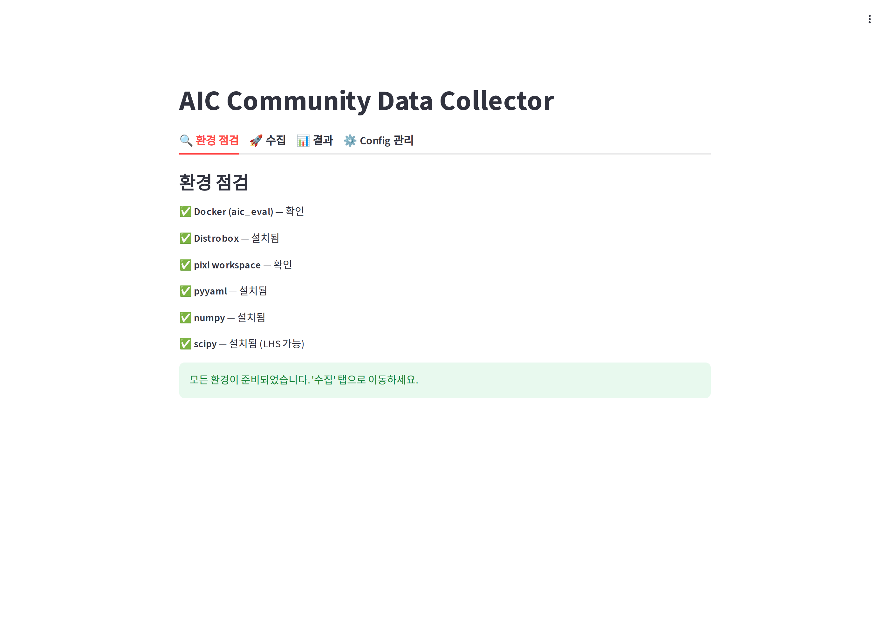
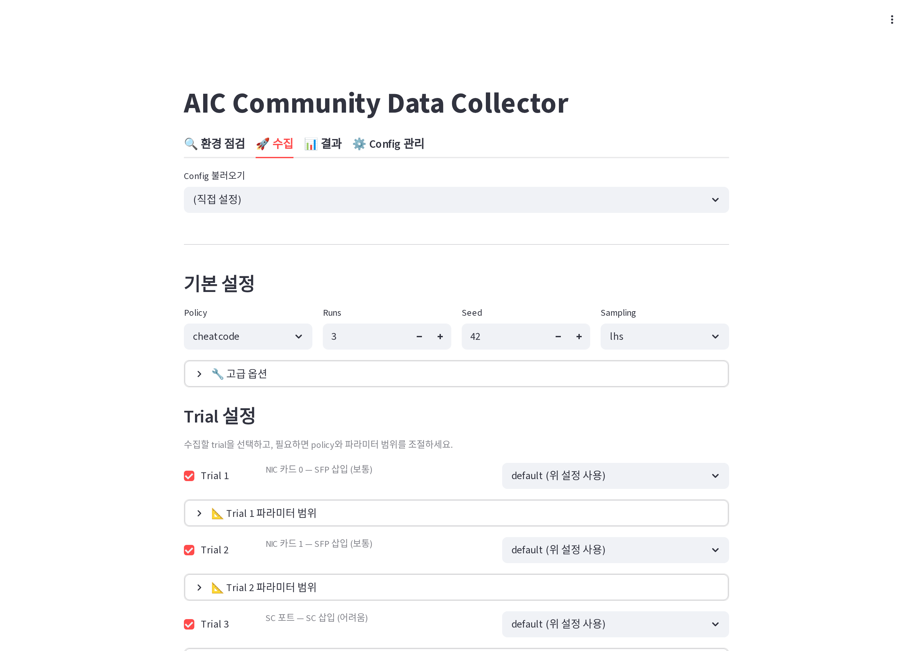
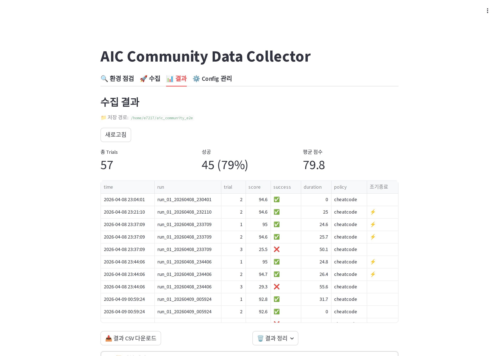
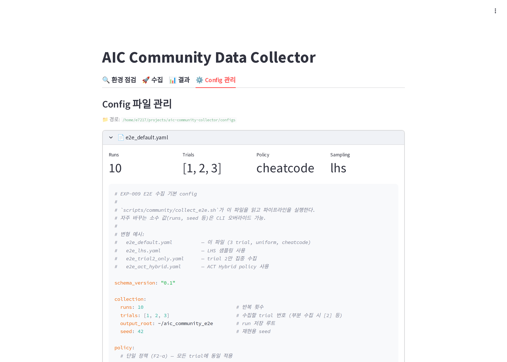

# 사용 가이드

AIC Community Data Collector의 전체 사용 흐름을 단계별로 설명합니다. README의 Quick Start로 시작이 안 되거나, 더 자세한 설명이 필요할 때 참고하세요.

## 목차

1. [처음 시작하기](#처음-시작하기)
2. [환경 점검](#환경-점검)
3. [데이터 수집](#데이터-수집)
4. [결과 확인](#결과-확인)
5. [Config 관리](#config-관리)
6. [고급: Prefect 대시보드](#고급-prefect-대시보드)
7. [문제 해결](#문제-해결)

---

## 처음 시작하기

### 설치

AIC 챌린지 환경(Docker, Distrobox, pixi, `~/ws_aic/src/aic`)이 이미 갖춰져 있다고 가정합니다. 없다면 [AIC Getting Started](https://github.com/intrinsic-dev/aic/blob/main/docs/getting_started.md)부터 진행하세요.

```bash
# uv 설치 (안 되어 있다면)
curl -LsSf https://astral.sh/uv/install.sh | sh

# 저장소 clone
git clone https://github.com/e7217/aic-community-collector
cd aic-community-collector
```

### 첫 실행

```bash
uv run src/aic_collector/webapp.py
```

처음 실행하면 의존성을 자동으로 설치합니다 (Prefect 포함, ~30초 소요). 실행되면 다음 메시지가 출력됩니다:

```
Local URL: http://localhost:8501
Network URL: http://192.168.x.x:8501
```

브라우저에서 `http://localhost:8501`로 접속하세요.

---

## 환경 점검

처음 접속하면 자동으로 **환경 점검** 탭이 표시됩니다.



### 체크 항목

| 항목 | 의미 | 실패 시 |
|------|------|---------|
| **Docker (aic_eval)** | `aic_eval` 컨테이너 존재 여부 | `distrobox create --nvidia -i ghcr.io/intrinsic-dev/aic/aic_eval:latest aic_eval` |
| **Distrobox** | distrobox 명령어 사용 가능 | `sudo apt install distrobox` |
| **pixi workspace** | `~/ws_aic/src/aic` 경로 존재 | AIC Getting Started 참고 |
| **pyyaml / numpy / scipy** | Python 의존성 | 자동 설치 버튼 또는 `uv sync` |

모든 항목이 ✅ 통과하면 **수집** 탭으로 이동하세요.

---

## 데이터 수집

### 모드 선택

수집 탭 상단의 **모드 라디오**에서 목적에 맞는 모드를 먼저 선택합니다.

| 모드 | 목적 | 결과물 |
|------|------|--------|
| 🔬 **Sweep** | 파라미터를 변화시키며 평가/실험 데이터 수집 | `~/aic_community_e2e/run_*/` (수집된 bag/scoring/episode) |
| 🎓 **Training** | 학습 데이터용 엔진 config 일괄 생성 | `configs/train/{sfp,sc}/config_*.yaml` |

- **Sweep**은 LHS/Uniform/Sobol 샘플링으로 N회 반복 수집을 실행합니다 (기존 흐름).
- **Training**은 SFP/SC task별로 scene이 다른 config 파일을 다량 만듭니다. 수집 자체는 별도로 실행합니다(후속 릴리스에서 원클릭 연동 예정).

Training 모드의 상세 규칙은 [Config Reference → Training Config](config-reference.md#training-config)를 참고하세요.

### Config 불러오기 (Sweep 모드)

기본 제공 Config 중 하나를 선택하거나, 직접 설정할 수 있습니다.

| Config | 용도 | 소요 시간 |
|--------|------|-----------|
| `e2e_default` | 표준 수집 (3 trial × 10 runs) | ~15분 |
| `e2e_test` | 빠른 테스트 (1 trial × 1 run) | ~2분 |
| `e2e_trial2_only` | Trial 2만 집중 수집 (5 runs) | ~5분 |
| (직접 설정) | 모든 옵션 수동 입력 | - |

### 기본 설정



| 항목 | 설명 | 권장값 |
|------|------|--------|
| **Policy** | 사용할 정책 (`cheatcode`/`act`/`hybrid`/사용자 추가) | `cheatcode` (안정적) |
| **Runs** | 반복 횟수 | 1~10 |
| **Seed** | 재현용 시드 | 임의 (예: 42) |
| **Sampling** | 파라미터 샘플링 전략 | `lhs` |

샘플링 전략 비교는 [Config Reference](config-reference.md#sampling)를 참고하세요.

### Trial 선택

수집할 trial을 체크합니다 (1=NIC0, 2=NIC1, 3=SC). 부분 수집도 가능합니다.

각 trial 옆 드롭다운에서 **trial별로 다른 policy**를 지정할 수도 있습니다 (예: trial 1은 cheatcode, trial 2는 act).

### 파라미터 범위 조정 (선택)

기본 파라미터 범위는 AIC 챌린지 표준값입니다. 좁은 범위로 집중 수집하려면 각 trial의 "파라미터 범위" expander를 펼쳐서 min/max를 조정하세요.

### Training 모드로 학습 데이터 config 만들기

1. 수집 탭 상단 모드를 **🎓 Training**으로 전환
2. `SFP configs` / `SC configs` 수량 입력 (권장 비율 5:2, 예 SFP=50 / SC=20)
3. `Seed` 값 지정 (재현 필요 없으면 기본값 유지)
4. **기존 번호에 이어서 생성** 토글 — 기본 ON. 끄면 0부터 생성(기존 파일은 유지)
5. **🎲 Target 분포 미리보기**로 균등 분포 확인
6. **🎓 Training configs 생성** 클릭 → `configs/train/sfp/`, `configs/train/sc/`에 파일 생성

생성된 config는 이미 완전한 scene을 포함하므로 엔진에 바로 넘길 수 있습니다. 생성 단계만 Training 모드가 담당하고, 실제 시뮬레이션 실행은 별도로 수행합니다.

### 수집 시작 (Sweep 모드)

**🚀 수집 시작** 버튼을 클릭합니다. 다음 순서로 진행됩니다:

1. **Prefect 서버 자동 기동** (이미 떠있으면 skip, ~5초)
2. **policy 배포**: `policies/*.py`를 pixi 환경으로 복사
3. **각 run 실행**: 파라미터 샘플링 → 엔진 config 생성 → Docker 재시작 → 엔진/Policy 실행 → 후처리

진행 중 화면에서 다음을 볼 수 있습니다:

- 현재 RUN 번호 (예: `RUN 2/10`)
- 실행 단계 메시지 (엔진 기동 중, Policy 실행 중 등)
- **실행 로그** expander — Prefect task별 출력

### 중지

**중지** 버튼을 누르면 실행 중인 Prefect 프로세스와 연결된 distrobox/pixi 프로세스를 모두 정리합니다. (SIGTERM → 2초 → SIGKILL)

### 동시 실행 방지

수집이 진행 중일 때 **수집 시작** 버튼을 다시 누르면 "이미 수집이 진행 중입니다" 에러가 표시됩니다. `~/aic_results` 디렉토리를 공유하기 때문에 동시 실행이 차단됩니다.

---

## 결과 확인

수집이 완료되면 **결과** 탭에서 통계와 trial별 상세 결과를 볼 수 있습니다.



### 메트릭

| 항목 | 의미 |
|------|------|
| **총 Trials** | 전체 시도 횟수 |
| **성공** | tier_3 점수 ≥ 임계값을 넘긴 trial 수와 비율 |
| **평균 점수** | 모든 trial의 평균 점수 |

### 결과 테이블

각 행은 1개 trial:

- **time**: 수집 시각
- **run**: run 디렉토리 이름
- **trial**: 1, 2, 3
- **score**: 점수 (0-100)
- **success**: ✅ 성공 / ❌ 실패
- **duration**: trial 소요 시간 (초)
- **policy**: 사용된 policy
- **조기종료**: F5 조기 종료 발생 여부

### CSV 다운로드

**결과 CSV 다운로드** 버튼으로 표 데이터를 내려받을 수 있습니다.

### 결과 파일 위치

UI에 표시되지 않는 실제 데이터(rosbag, 이미지, npy)는 다음 경로에 저장됩니다:

```
~/aic_community_e2e/
└── run_01_20260408_234406/
    ├── config.yaml          # 사용된 엔진 config
    ├── trial_1_score95/
    │   ├── bag/             # ROS bag (mcap + metadata)
    │   ├── episode/
    │   │   ├── images/      # left/center/right PNG
    │   │   ├── states.npy
    │   │   ├── actions.npy
    │   │   └── metadata.json
    │   ├── scoring.yaml
    │   └── tags.json
    ├── trial_2_score95/
    └── trial_3_score25/
```

---

## Config 관리



### 저장된 Config 조회

`configs/` 디렉토리의 모든 `e2e_*.yaml` 파일이 표시됩니다. 각 파일을 클릭하면 전체 YAML 내용과 요약 메트릭(Runs, Trials, Policy, Sampling)이 펼쳐집니다.

### 새 Config 저장

수집 탭에서 설정을 마친 뒤 **현재 설정을 Config 파일로 저장** expander에서 파일 이름을 입력하면 `configs/e2e_<이름>.yaml`로 저장됩니다.

### 삭제

기본 제공 config(`e2e_default.yaml`)는 보호되어 있고, 사용자가 만든 config만 삭제할 수 있습니다.

전체 항목 상세 설명은 [Config Reference](config-reference.md)를 참고하세요.

---

## 고급: Prefect 대시보드

수집을 시작하면 백그라운드에 **Prefect 서버**가 자동으로 기동됩니다 (`localhost:4200`). 평상시 수집 탭만으로 충분하지만, **자세한 디버깅이나 과거 실행 이력 조회**가 필요할 때 사용합니다.

### 접속

```
http://localhost:4200
```

처음 접속 시 "Join the Prefect Community" 모달이 뜨면 **Skip**으로 닫으세요.

### 대시보드


- **Flow Runs**: 전체 수집 실행 횟수와 상태별 분포
- **Task Runs**: 각 task의 실행/성공/실패 통계

### Runs (실행 이력)


좌측 메뉴 **Runs**에서 모든 flow run을 시간순으로 조회. 각 run의 이름(예: `gregarious-swift`)을 클릭하면 상세 화면으로 이동합니다.

### Flow Run 상세


- **타임라인**: 각 task의 실행 구간과 소요 시간
- **로그**: 모든 task의 stdout/stderr
- **상태**: Pending → Running → Completed/Failed

### Artifacts (run 요약)

좌측 메뉴 **Artifacts**에서 각 run의 markdown 요약을 볼 수 있습니다.


각 artifact를 클릭하면 상세 페이지로 이동:


요약에는 다음이 포함됩니다:
- 상태 (성공/실패)
- Policy, Seed
- Trial별 점수
- 사용된 파라미터 값
- 출력 디렉토리 경로

> Prefect는 메타데이터만 보여주는 도구입니다. 실제 rosbag/이미지/npy 파일은 `~/aic_community_e2e/`에서 직접 확인하세요.

---

## 문제 해결

### "Error response from daemon: unable to find user e7217"

컨테이너 초기화가 안 된 상태에서 진입을 시도해 발생합니다. 스크립트가 자동으로 `distrobox enter`로 초기화하지만, 처음 컨테이너를 만든 직후에는 추가로 1~2분이 걸릴 수 있습니다.

해결: 컨테이너를 새로 만들었다면 한 번 수동으로 진입하여 초기화를 완료합니다.

```bash
distrobox enter aic_eval -- true
```

### Policy 타임아웃 (300초)

Policy가 `on_shutdown` 메시지를 출력하지 않고 멈추면 발생합니다. 원인:

- 엔진이 제대로 기동되지 않음 → `/tmp/e2e_engine_*.log` 확인
- Policy 코드 오류 → `/tmp/e2e_policy_*.log` 확인
- 하드웨어 응답 없음 → ROS 토픽 상태 확인

Prefect 대시보드의 task별 로그가 가장 정확합니다.

### "이미 수집이 진행 중입니다"

이전 수집이 비정상 종료되어 상태 파일이 남아있을 때 발생합니다.

```bash
# 임시 상태 파일 정리
rm -f /tmp/e2e_webapp_state.json /tmp/e2e_prefect_progress.json
```

또는 webapp **중지** 버튼을 누른 뒤 **확인** 클릭.

### 수집은 됐는데 결과 탭이 비어있음

`~/aic_community_e2e/` 디렉토리 권한을 확인하세요. webapp은 이 경로를 스캔해서 결과를 불러옵니다.

### 디스크 공간 부족

raw 이미지 모드에서는 run당 ~58GB가 쌓입니다. 압축 모드로 전환하거나 오래된 run 디렉토리를 정리하세요.

```yaml
# config에서
engine:
  use_compressed: true   # ~3GB/run
```

자동 정리: webapp이 수집 시작 시 7일 이상 된 `/tmp/e2e_*` 파일과 `~/aic_results_e2e_backup_*`를 자동으로 삭제합니다.

### Prefect 서버가 안 뜸

수동으로 띄울 수 있습니다:

```bash
PREFECT_UI_API_URL=http://localhost:4200/api uv run prefect server start --host 0.0.0.0 --port 4200
```

webapp을 재시작하면 다음 수집부터 자동으로 사용됩니다.

### 로그 위치 정리

| 파일 | 내용 |
|------|------|
| `/tmp/e2e_webapp_run.log` | webapp이 실행한 Prefect 프로세스 통합 로그 |
| `/tmp/e2e_engine_<TAG>_run<N>.log` | 엔진 stdout |
| `/tmp/e2e_policy_<TAG>_run<N>.log` | Policy stdout |
| `/tmp/e2e_prefect_server.log` | Prefect 서버 로그 |
| `/tmp/e2e_prefect_progress.json` | 진행 상태 (구조화) |
| `/tmp/e2e_webapp_state.json` | 현재 실행 중인 프로세스 정보 |
